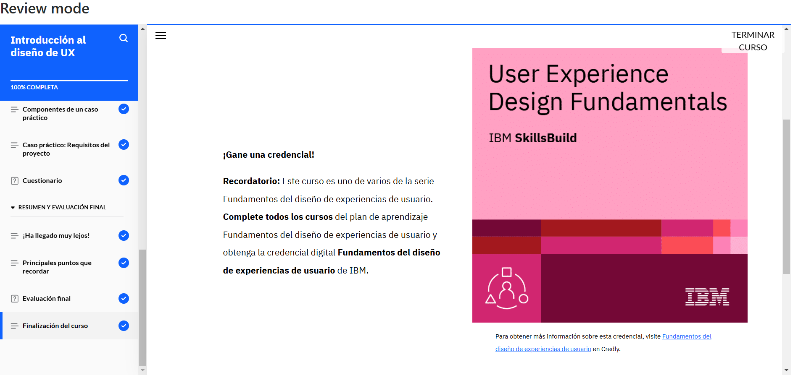

# **Curso: Introducción al diseño de UX**

El curso abordó los principios fundamentales del Diseño de Experiencia de Usuario (UX) y su relación con el Diseño de Interfaz de Usuario (UI). Se exploraron conceptos clave como la facilidad de uso, accesibilidad y arquitectura de la información, con el objetivo de crear productos intuitivos y centrados en el usuario. Addemás, se profundizó en el Diseño Centrado en el Usuario (UCD), un proceso iterativo basado en la retroalimentación y necesidades de los usuarios. Se analizaron los enfoques de diseño reactivo y adaptativo para garantizar una experiencia óptima en diferentes dispositivos.  

# **Evidencia actividad finalizada**

