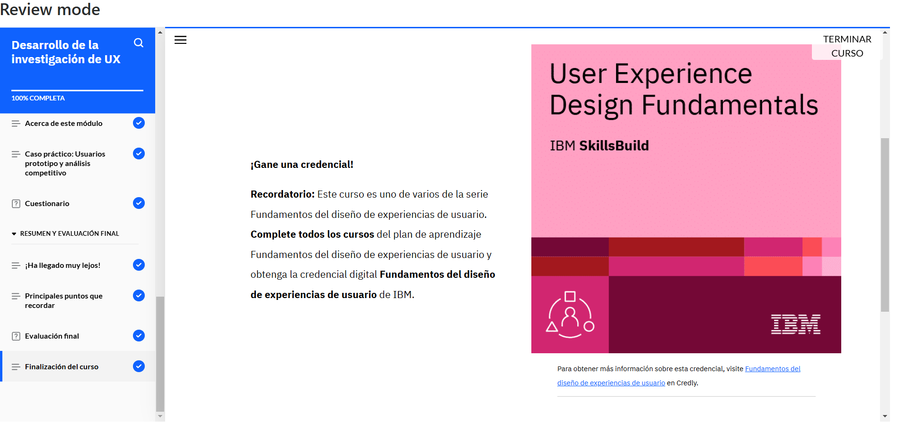

# **Curso: Desarrollo de la investigación de UX**

El curso abordó el proceso de investigación en UX, el cual permite comprender mejor a los usuarios y mejorar la experiencia de los productos. Se estudiaron los pasos clave, desde la formulación de hipótesis hasta la síntesis de datos, pasando por la selección de métodos de investigación y la creación de usuarios prototipo.

Además, se explicó el uso de usuarios prototipo, que representan a grupos de usuarios y ayudan en la toma de decisiones durante el diseño. Finalmente, se estudiaron el análisis competitivo y comparativo, ya que permite evaluar productos frente a la competencia y otras soluciones del mercado.

# **Evidencia actividad finalizada**

