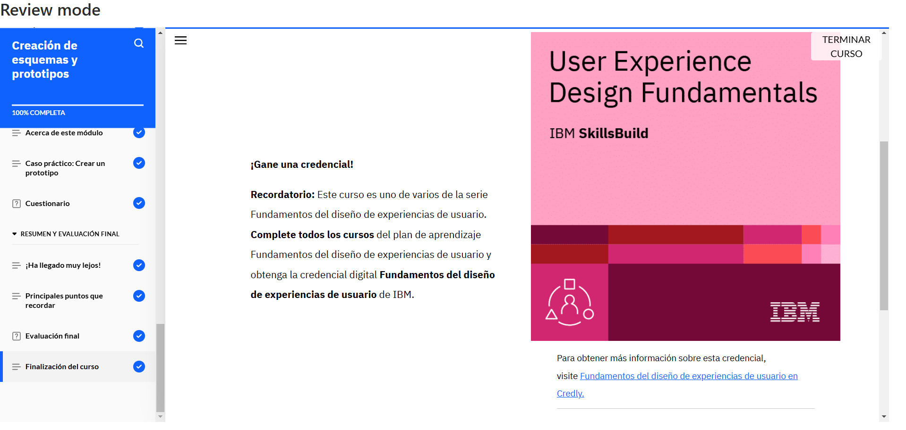

# **Curso: Creación de esquemas y prototipos**

El curso abordó la escritura de UX, enfocada en la creación de textos claros y efectivos en interfaces digitales para mejorar la experiencia del usuario. También se estudió la Arquitectura de la Información (IA), que organiza y estructura el contenido de forma lógica, utilizando técnicas como la clasificación por tarjetas para evaluar su eficacia.

Se exploraron herramientas clave como los mapas de sitio y los esquemas, que ayudan a visualizar la estructura y funcionalidad de un producto digital. Además, se profundizó en el diseño de UI, centrado en la creación de interfaces accesibles y visualmente atractivas, aplicando principios de claridad, flexibilidad y gestión de errores.

# **Evidencia actividad finalizada**

