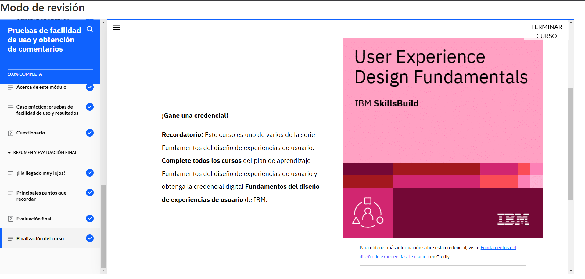

# **Curso: Pruebas de facilidad de uso y obtención de comentarios**

El curso exploró las pruebas de facilidad de uso como un método clave en la investigación de UX para evaluar la experiencia de usuario y detectar problemas mediante la observación de usuarios reales. Se analizaron sus objetivos, como la identificación de dificultades, la búsqueda de oportunidades y la recopilación de información sobre los usuarios.

El proceso de pruebas incluye definir objetivos, seleccionar participantes, ejecutar pruebas, registrar datos y analizarlos. Se explicó la evaluación heurística como técnica para detectar problemas de usabilidad. También se discutieron estrategias para priorizar problemas según su impacto y costo, utilizando matrices de impacto-esfuerzo.

Finalmente, el curso destacó la importancia de iterar y perfeccionar los prototipos con base en los resultados obtenidos, asegurando que el diseño final satisfaga las necesidades de los usuarios.

# **Evidencia actividad finalizada**

