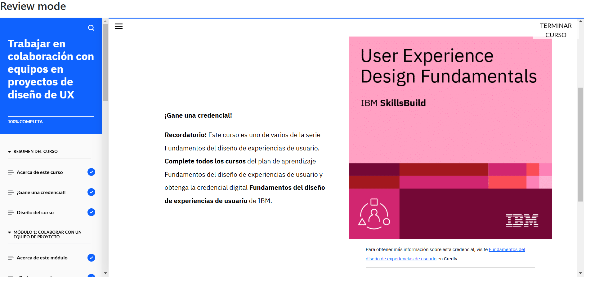

# **Curso: Trabajar en colaboración con equipos en proyectos de diseño de UX**

El curso abordó la importancia de los equipos multidisciplinares en el diseño de UX, destacando su capacidad para generar valor, fomentar la colaboración y mejorar la eficiencia. Se detallaron los roles clave dentro de un equipo de UX, incluyendo gestores de producto, diseñadores, investigadores y desarrolladores.

Se exploraron prácticas recomendadas para la colaboración efectiva, como reuniones de lanzamiento, revisiones de diseño y el uso de herramientas de colaboración. También se analizó el proceso de traspaso de diseño a desarrollo, asegurando la correcta implementación de especificaciones, maquetas y prototipos.

# **Evidencia actividad finalizada**

