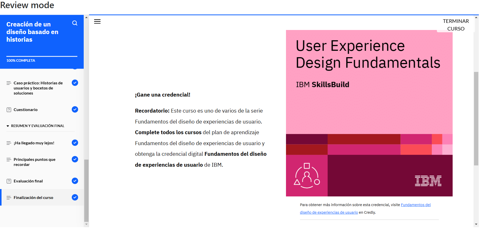

# **Curso: Creación de un diseño basado en historias**

El curso abordó la importancia de las historias de usuario en el diseño de UX, las cuales ayudan a captar y comunicar las necesidades, objetivos y expectativas de los usuarios. Se explicó su formato basado en tres componentes: rol, acción y ventaja, y se detallaron los pasos para crearlas utilizando usuarios prototipo.

Finalmente, se abordó el uso de bocetos de soluciones, herramientas esenciales en las primeras fases del diseño para generar ideas de forma rápida y colaborativa, utilizando medios físicos o digitales.

# **Evidencia actividad finalizada**

