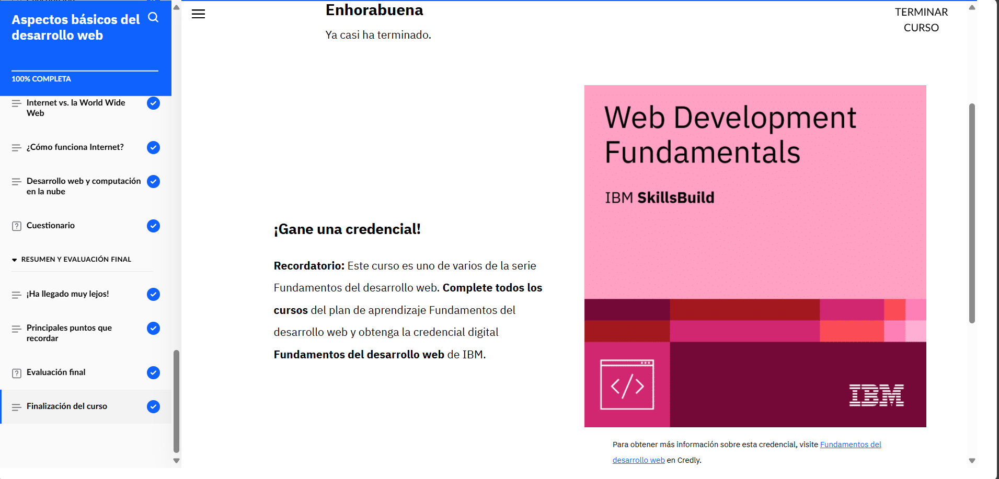

# **Curso: Aspectos básicos del desarrollo web**

Al finalizar este curso, he aprendido las cuatro funciones básicas de un ordenador: entrada, proceso, salida y almacenamiento, ya que estas funciones son esenciales para todos los dispositivos, sin importar su tamaño y también entendi que el código binario, compuesto por ceros y unos, es el lenguaje que los ordenadores comprenden. El curso abordó la importancia del hardware y el software en el funcionamiento del ordenador. 

En el desarrollo web, vi que el proceso incluye planificación, diseño, codificación, prueba, publicación y mantenimiento. Los desarrolladores front-end se encargan de la parte visual de los sitios web utilizando tecnologías como HTML, CSS y JavaScript, mientras que los desarrolladores back-end gestionan la lógica del servidor y las bases de datos.

En resumen, este curso me proporcionó una base sólida sobre cómo funcionan los ordenadores y cómo se desarrollan sitios web funcionales y accesibles, utilizando tecnologías y principios clave.

# **Evidencia actividad finalizada**

