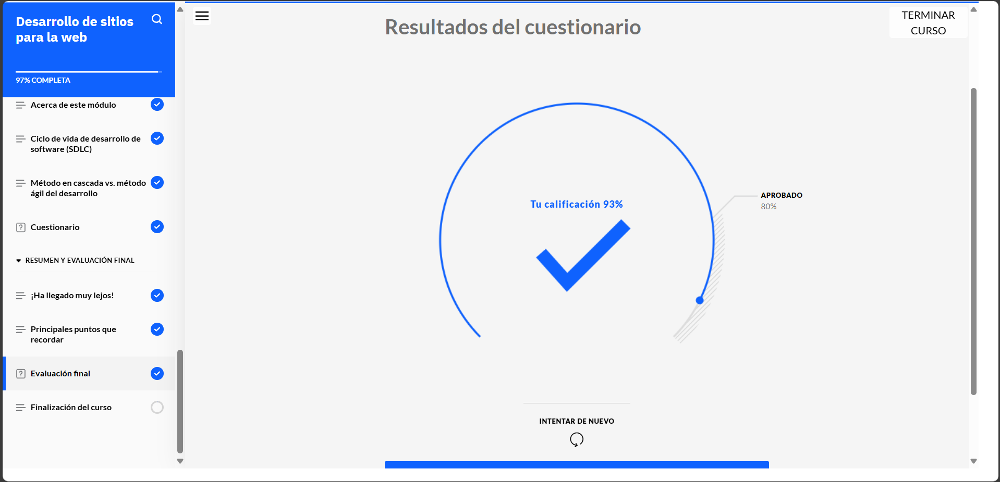
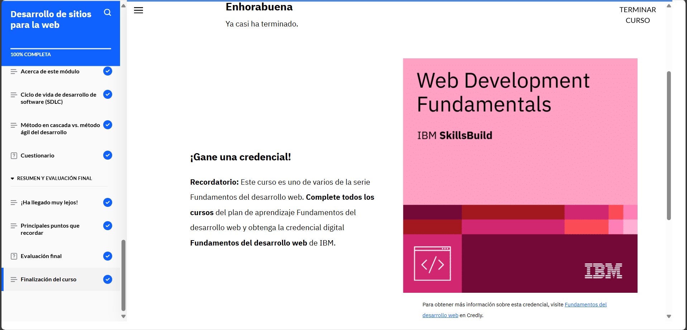

# **Curso: Fundamentos del desarrollo web moderno**

En este curso aprendí varias cosas sobre cómo funcionan las páginas web y una de las cosas más interesantes fue entender que el navegador es quien se encarga de leer el código HTML y mostrarlo con colores, estilos y formatos para que lo podamos ver bonito y ordenado. El HTML en sí es solo texto con etiquetas que indican qué hacer con cada parte, como si fuera una guía para el navegador.

También vi que los documentos HTML necesitan estar bien estructurados, además que los marcos o frameworks que usan JavaScript son para hacer que los sitios web sean más dinámicos. Para el diseño visual usamos CSS, que nos permite aplicar estilos de forma más fácil y organizada, sin tener que repetirlos en cada parte.

CSS se encarga de cómo se ve todo, y JavaScript hace que las cosas respondan, como cuando haces clic en un botón, aparecen ventanas o la página se actualiza sin recargar. HTML, CSS y JavaScript trabajan juntos para crear todo lo que vemos y usamos en un sitio web.

También vi formas de trabajar en proyectos. Por ejemplo, el método en cascada sigue pasos uno tras otro, como una receta. En cambio, el enfoque ágil es más flexible: se repiten los pasos cuando hace falta y se mejora constantemente. Dentro del ágil, está Scrum, que divide el trabajo en ciclos cortos llamados sprints, y tiene reuniones específicas para que el equipo siempre sepa en qué está trabajando.

# **Evidencia actividad finalizada**

