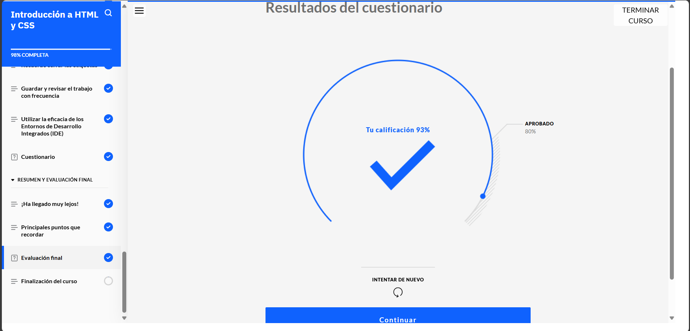
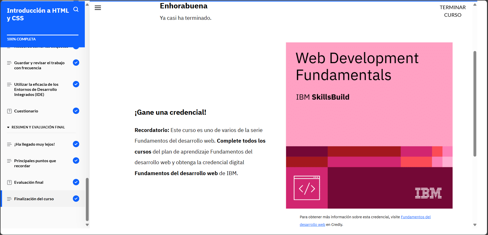

# **Curso: Introducción a HTML y CSS**

En este curso aprendí muchas cosas útiles sobre cómo se construyen las páginas web, empezando por las etiquetas HTML, que son como piezas básicas del código. HTML es un lenguaje declarativo, lo que quiere decir que solo indica qué se debe mostrar, no cómo lo hace el navegador.

También se complementó cómo usar CSS, que es el lenguaje para darle diseño a la web. CSS se puede usar directamente en el HTML, pero lo mejor es tenerlo en un archivo aparte con la extensión .css. 

Aprendí sobre los diferentes selectores que se usan para aplicar estilos: por clase (.clase), por id (#id), por el nombre de la etiqueta (h1, p, etc.), o directamente con un estilo en línea.

Otra cosa importante es seguir buenas prácticas, como declarar el < !DOCTYPE html > al principio del archivo, cerrar bien las etiquetas, usar hojas de estilo y guardar el trabajo frecuentemente.

# **Evidencia actividad finalizada**

