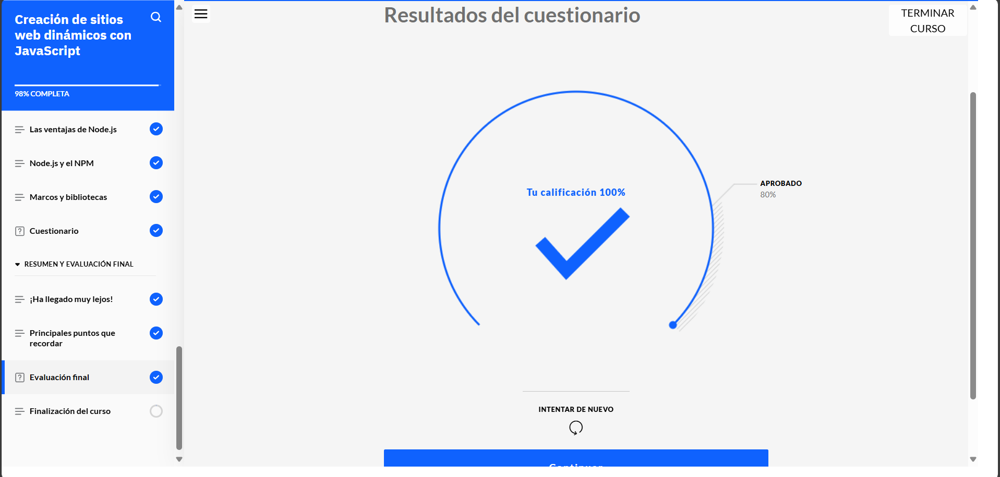
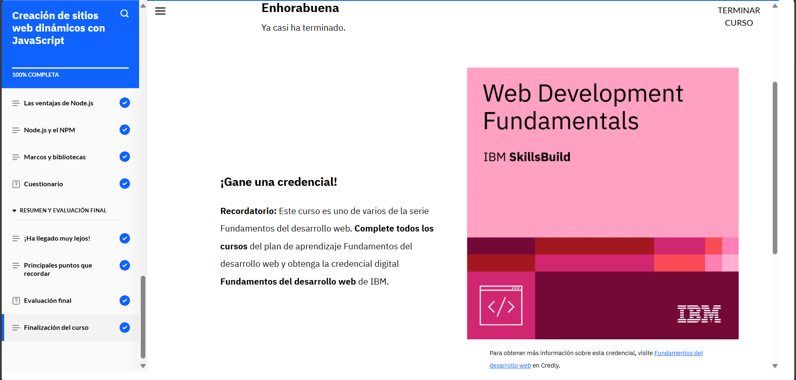

# **Curso: Creación de sitios web dinámicos con JavaScript**

JavaScript tiene cosas de programación funcional y también de programación orientada a objetos. Los objetos pueden tener propiedades, métodos, valores constantes y hasta manejar sucesos. Gracias a esto, se puede reutilizar código, heredar características de otros objetos y mantener todo organizado dentro de estructuras.

Además, sobre bases de datos, estas se organizan en tablas, que a su vez tienen registros (como filas con datos). Hay cuatro operaciones básicas que se hacen con una base de datos: crear, leer, actualizar y eliminar. Esto se conoce como CRUD por sus siglas en inglés.

Para trabajar con bases de datos se usa SQL, un lenguaje que nos permite hacer esas operaciones y consultar la información que necesitamos.

También que Node.js, es rápido y no bloquea procesos, así que es ideal para crear aplicaciones web modernas. Y gracias a NPM, podemos agregar fácilmente paquetes, librerías o frameworks que ya han creado otros desarrolladores, lo cual nos ahorra mucho tiempo y esfuerzo.

# **Evidencia actividad finalizada**

