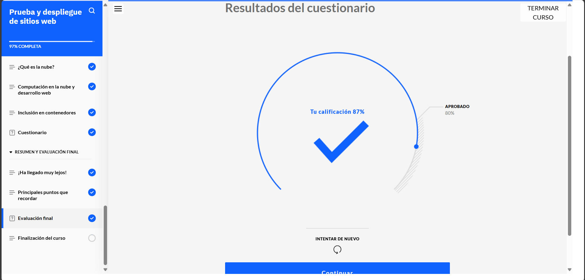
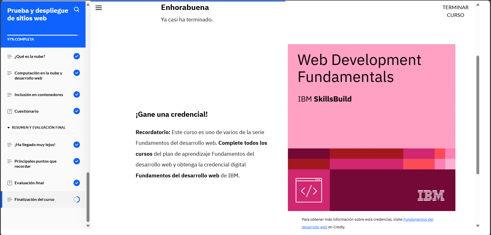

# **Curso: Prueba y despliegue de sitios web**

Conocí varios tipos de pruebas como usabilidad, rendimiento, integración y aceptación, cada una con un enfoque diferente.

Al probar un sitio, se deben revisar cosas como el diseño responsive, la interfaz, el código, las APIs y las bases de datos. También vi cómo usar control de versiones para llevar un registro de cambios y trabajar en equipo de forma ordenada. Además, se revisó el enfoque DevOps, que mejora la colaboración entre desarrollo, operaciones y negocio.

Otros temas clave fueron el uso de HTTP, el diseño adaptable, los frameworks que facilitan el desarrollo, y los wrappers para convertir sitios en apps. También vi cómo automatizar despliegues con herramientas de línea de comandos y la nube.

Finalmente, conocí los contenedores de software, que permiten ejecutar aplicaciones fácilmente en distintos entornos.

# **Evidencia actividad finalizada**

