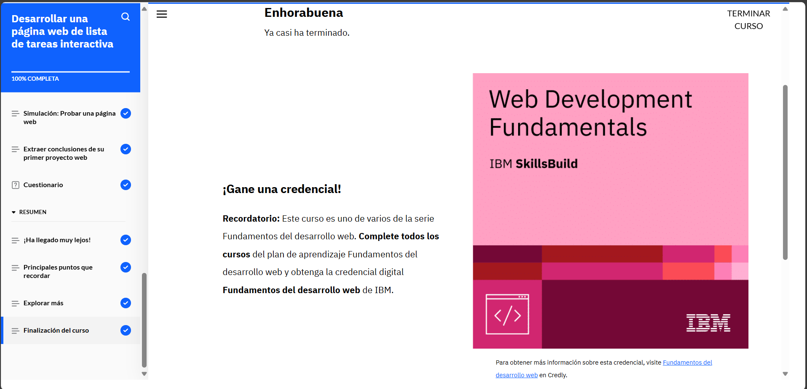

# **Curso: Desarrollar una página web de lista de tareas interactive**

Lo que aprendí es que el desarrollo web no solo se trata de codificar, sino también de diseñar y hacer pruebas para asegurarse de que todo funcione bien. En mi caso, la página que creé es para que los empleados puedan hacer un seguimiento de sus tareas, usando una lista interactiva. Para esto, revisé los requisitos con el gestor de producto y un diagrama de wireframes del diseñador.

Tuve la oportunidad de practicar usando VS Code, donde configuré archivos HTML, CSS y JavaScript. Primero, escribí el HTML para crear la estructura de la página, luego apliqué estilos con CSS para que fuera atractiva. Después, añadí interactividad con JavaScript para que los usuarios puedan añadir tareas y hacer cosas como marcar tareas completadas. Finalmente, probé todo para asegurarme de que la página funcione correctamente.

# **Evidencia actividad finalizada**

