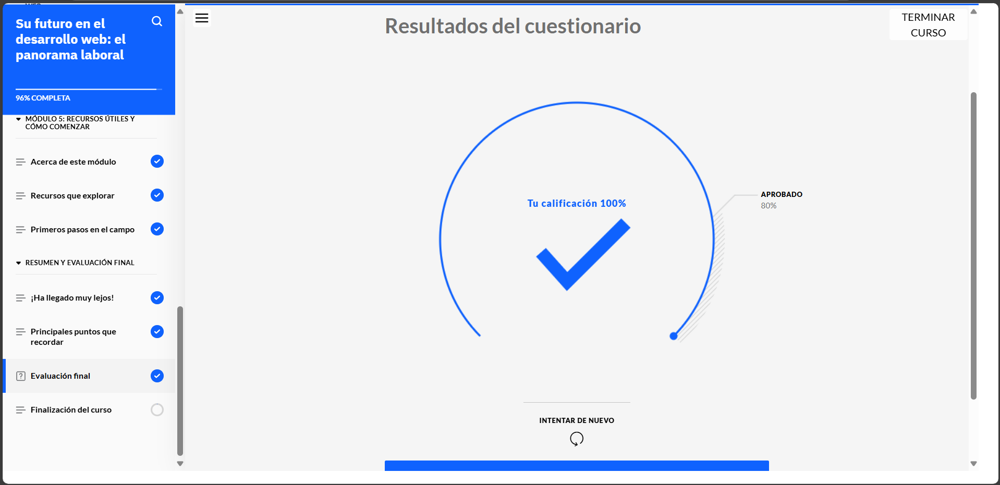
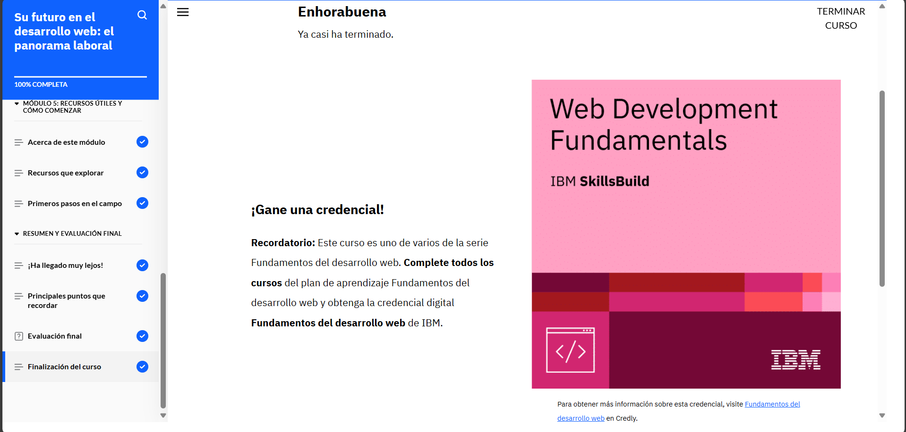

# **Curso: Su futuro en el desarrollo web: el panorama laboral**

En el curso aprendí un montón sobre desarrollo web, me di cuenta de que hay mucha demanda de gente con estas habilidades porque las empresas necesitan buenos sitios para vender y conectar con sus clientes. Además, es un campo con muchas oportunidades para crecer.

Aprendí sobre los tres roles principales: front-end, back-end y full-stack. No solo se trata de saber programar, sino también de comunicarte bien, resolver problemas y trabajar en equipo.

Me gustó ver cómo se organizan los equipos y cómo cada uno aporta algo al proyecto, si te gusta la tecnología, eres curioso y creativo, el desarrollo web es una gran opción. A mí me dejó con muchas ganas de seguir aprendiendo.

# **Evidencia actividad finalizada**

