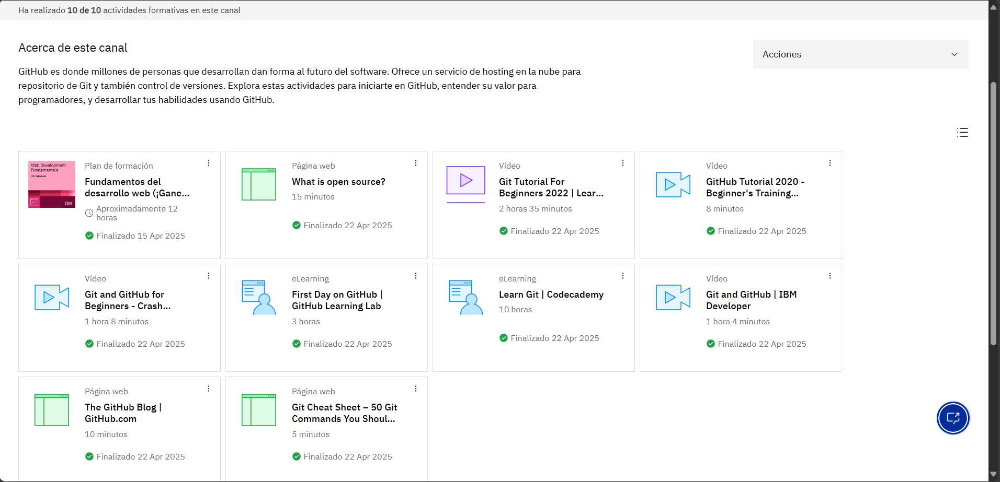

# **Canal: Desarrollo web: aprende GitHub**

Este canal me ha servido muchísimo para entender GitHub, al principio sí me costaba un poco, pero los cursos que tiene explican todo súper claro y desde lo más básico, así que no se necesita saber mucho para empezar. Poco a poco fui entendiendo cómo funciona el control de versiones, cómo colaborar con otras personas en proyectos y cómo organizar bien mi código. Además, los vídeos que usan son un poco prácticos.

# **Evidencia actividad finalizada**

