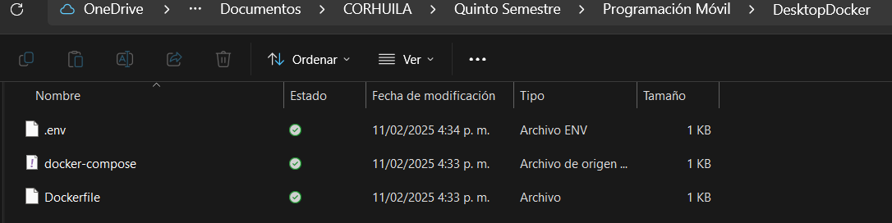

# Documentación contenedor en docker y configuración en MYSQL

### Estudiante: 
- Karen Johana Caicedo Arias

## Paso 1: 
Se crea un carpeta en la ubicación de su preferencia y luego se descargan los archivos llamados ".env" , "docker-compose" y "Dockerfile" , para ubicarlos en esa carpeta.

### Imagen de representación

### Paso 2:
Se realiza la apertura de los archivos ".env, docker-compose y Dockerfile" en Visual Studio Code, cambiando el puerto en este caso al 3309 ya que el 3306 provocaba error. 

### Imagen revisando los archivos

## Paso 3: 
Abrir Docker, además en la carpeta donde se ubican los archivos abrir el cmd para utilizar los siguientes comandos de crear y montar el contenedor.

- docker build -t custom-mysql .
- docker-compose down
- docker-compose up -d --build

### Imagen Comandos

## Paso 4: 
Verificar que el contenedor este corriendo funcionalmente en el Docker.

### Imagen Docker

## Paso 5:
Abrimos Workbench, añadimos una nueva conexión con el nombre del contenedor y el puerto.

#### Imagen Workbench

## Paso 6:
Nos ubicamos en el Docker, exactamente en el exec de nuestro contenedor para digitar los siguientes comandos, comprobando la funcionalidad.

### Imagen Exec

## Paso 7:
En la conexión creada de MYSQL ingresamos con la contraseña correspondiente, finalmente comprobamos que la base y la tabla se hayan creado con éxito.

### Imagen conexión
