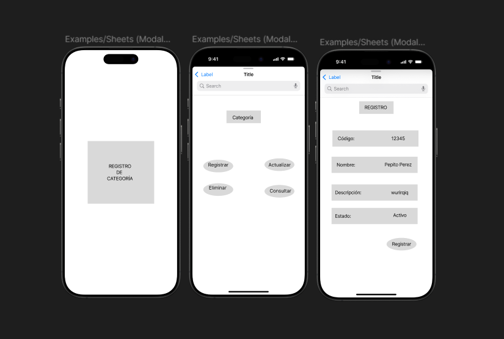

# Ejercicio Mockup

## Descripción
Como administrador del sistema,
quiero registrar, actualizar, eliminar y consultar categorías de productos,
para gestionar eficientemente la organización de los productos dentro del sistema.
## Criterios de Aceptación
### Registro de Categorías:
- Se debe permitir crear una nueva categoría con los campos:
- id (generado automáticamente)
- codigo (alfanumérico único)
- nombre (obligatorio)
- descripcion (opcional)
- estado (activo/inactivo)
### Edición de Categorías:
- Se debe permitir modificar el nombre, descripcion y estado de una categoría existente.
- No se debe permitir modificar el id ni el codigo después de la creación.
### Eliminación de Categorías:
- Se debe permitir eliminar una categoría si no está asociada a productos.
### Consulta de Categorías:
- Se debe listar todas las categorías registradas.
- Se debe permitir filtrar por codigo y nombre.
## Criterios de Finalización
- La funcionalidad está desarrollada y probada.
- El código está revisado y aprobado en una Pull Request.
- Se ha realizado una demostración al Product Owner y ha sido aprobada.
- La documentación y pruebas están actualizadas.

## Evidencia:

## Enlace:

[Enlace_Mockup](https://www.figma.com/design/eB69Pci9lgqH5lifXRjOrh/Actividad?node-id=0-1&t=YYi17LhKf5rcaYL9-1)